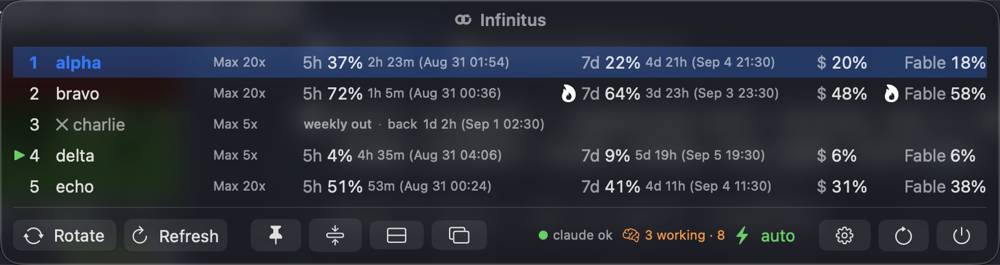
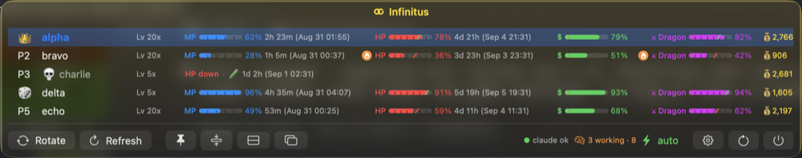
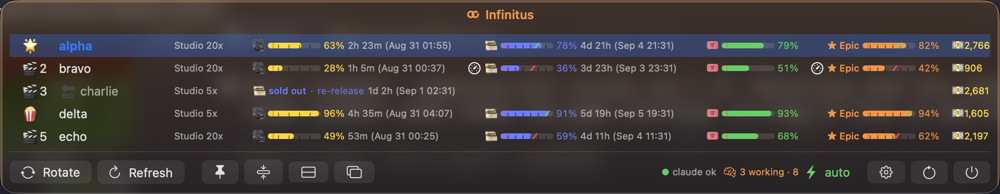
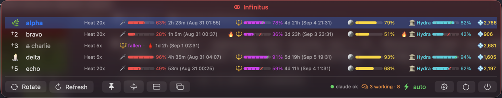
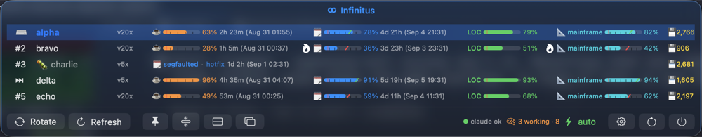
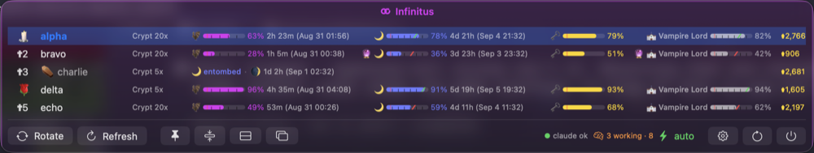
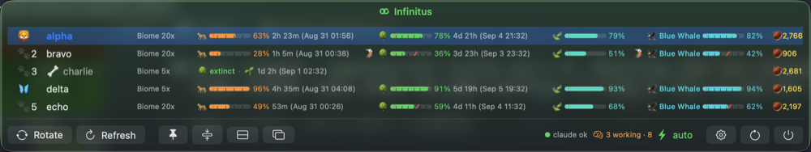
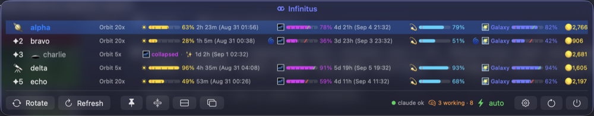

# Infinitus

**Every Claude account in one menu bar — swap before you stall.**

May your limits never bind.

[](https://github.com/deathemperor/infinitus/releases)

[](https://github.com/deathemperor/homebrew-tap)
[](LICENSE)


A native macOS menu bar app (Swift/SwiftUI) over the
[claude-swap](https://github.com/deathemperor/claude-swap) engine: live
usage gauges for a whole fleet of Claude accounts, auto-switch awareness,
and a one-click rotate — wrapped in themes from RPG to Wild West.

## Why

Claude usage windows run out at the worst moment. If you keep more than
one account, the juggling — which one has 5-hour headroom, which weekly
window is about to bind, which one just died — is exactly the kind of
state a menu bar should carry for you. Infinitus shows the whole fleet at
a glance and swaps before you stall.

## Install

### Homebrew

```sh
brew install --cask deathemperor/tap/infinitus
```

Nightly channel (built from `main` every day; reinstall to update —
or flip the track in-app under About → Update channel):

```sh
brew install --cask deathemperor/tap/infinitus@nightly
```

Builds are ad-hoc signed, not notarized: if Gatekeeper balks, install
with `--no-quarantine` (or right-click → Open once).

### GitHub releases

Grab `Infinitus-<version>.zip` from
[releases](https://github.com/deathemperor/infinitus/releases), unzip,
drop `Infinitus.app` into `/Applications`.

### Linux — the engine CLI (Omarchy-ready)

The menu bar app is macOS-native (AppKit), so Linux doesn't get the app
itself — it gets the engine. Everything Infinitus fronts (the fleet
gauges, auto-switching, the `cswap` TUI) runs anywhere Python 3.12
does, including Arch-based [Omarchy](https://omarchy.org):

```sh
brew install deathemperor/tap/claude-swap    # Homebrew on Linux (or macOS)
uv tool install claude-swap                  # or straight from PyPI
```

Arch users can build from [`packaging/aur/PKGBUILD`](packaging/aur/) —
`cswap` in a terminal is the same account switching, Omarchy-style.

> **Untested on Linux.** The formula and PKGBUILD are built from the
> PyPI package and have only been exercised on macOS so far — reports
> welcome.

### Requirements

- macOS 14+ (best on macOS 26 — the glass chrome uses it)
- the `cswap` CLI on PATH (`uv tool install claude-swap` /
  `pipx install claude-swap`) — the app's first-run card installs it
  for you

## Features

- **Menu bar usage** — active account name plus 5h/weekly percentages
  in the bar (used or remaining, your pick), glyph-only mode too.
- **Every account at a glance** — live 5-hour / weekly / per-model
  gauges for the whole fleet, pace markers when a window is burning
  faster than time passes, reset countdowns, dead rows with the cause.
- **Auto-switch aware** — the next-candidate pick, a themed marker on
  the active account, switch history, a celebration sweep on every
  switch (and a death beat when an account runs out).
- **Themes** — RPG (HP/MP + gold), Movie, Hades, Metal Gear, AI
  Agentic, Classic SWE, Sci-Fi, Wild West, Cyberpunk, Gothic, Musical,
  Planet Earth, Cosmos, Ocean, or plain numbers; a Themes settings pane
  with card grid, your own skins via `themes.json`, and a community
  gallery.
- **Glass popup** — real backdrop blur in every focus state, with a
  transparency dial; a launch intro (slides, bar fill-up, title
  flourish — all tunable in the debug pane).
- **Right-click menu** on the bar icon — themes, rotate, refresh,
  pin, pop out, settings, restart, quit; pairs with a setting that
  hides the popup's buttons but keeps the status chips.
- **Sessions & status chips** — live Claude Code session counter
  (busy/idle breakdown), engine status, auto-mode indicator.
- **Cost estimates** — 7-day per-account API-list-price estimates
  (estimates, never billing truth).
- **iCloud settings sync** + file export/import (never credentials).
- **Push notifications** — switch/limit events to Slack, Discord,
  Telegram or a webhook; secrets travel over stdin, shown masked.
- **Pop-out window, compact mode, stacked/wide layouts, popup
  scaling** — the pop-out remembers its spot across restarts.

## Privacy

Everything stays on your machine. The app talks to the engine through
`cswap … --json` subprocesses and never reads its files; usage-cost
figures are estimates, never billing truth; push-notification secrets
travel over stdin and render masked.

## Build from source

```sh
./make-app.sh && open Infinitus.app
```

`swift test` runs the CswapCore unit tests. `dev.sh` is a rebuild-on-save
loop (needs `entr`). `run-unbundled.sh` runs the executable outside the
bundle — a workaround for a login session whose menu bar stops adopting
new bundled apps (see the script header).

## Architecture rule

Everything is Swift; the engine stays fully isolated behind
`cswap … --json` subprocesses. The app never reads engine internals from
disk.

## Themes

Every theme reskins the whole row: gauge labels, the model name, the
active / next / dead markers, and the reset countdown wording.

| Theme | "Fable" becomes | active · next · dead | ready / resetting |
|---|---|---|---|
| Off — plain numbers | Fable | — | — |
| RPG — HP/MP gauges + gold | Dragon | 👑 🎲 💀 | full HP / respawning… |
| Movie — reels & box office | Epic | 🌟 🍿 🔚 | now showing / premiering… |
| Hades — blades & darkness | Hydra | 🌿 🕯 ☠ | unscathed / raising the dead… |
| Metal Gear — tactical espionage | FOXHOUND | 🐍 🎯 ☠ | all clear / extraction inbound… |
| AI Agentic — tokens & context | frontier | 🧠 ⏭ 🔌 | ready to ship / rate limit lifting… |
| Classic SWE — hand-written, no AI | mainframe | ⌨️ ⏭ 🐛 | compiles clean / recompiling… |
| Sci-Fi — warp cores & shields | Mothership | 🧑‍🚀 📡 💥 | all systems go / recharging… |
| Wild West — six-guns & gold rush | Outlaw | 🏇 🌵 🪦 | saddled up / sun's rising… |
| Cyberpunk — chrome & neon | Netrunner | ⚡ 🕶 💀 | jacked in / rebooting… |
| Gothic — candles & cathedrals | Vampire Lord | 🕯 🌹 ⚰️ | immortal / tolling midnight… |
| Musical — tempo & encores | Maestro | 🎷 🎻 🔇 | in tune / tuning up… |
| Planet Earth — wild documentary | Blue Whale | 🦁 🦋 🦴 | thriving / migrating… |
| Cosmos — stars & black holes | Galaxy | 🪐 🔭 🕳 | shining / orbiting back… |
| Ocean — tides & deep water | Leviathan | ⛵ 🐬 ⚓ | smooth sailing / tide turning… |

### Gallery

The same five-account demo fleet under every theme (pop-out window,
wide layout; charlie is out of their weekly window).

**Off — plain numbers**



**RPG — HP/MP gauges + gold**



**Movie — reels & box office**



**Hades — blades & darkness**



**Metal Gear — tactical espionage**


**AI Agentic — tokens & context**


**Classic SWE — hand-written, no AI**



**Sci-Fi — warp cores & shields**


**Wild West — six-guns & gold rush**


**Cyberpunk — chrome & neon**


**Gothic — candles & cathedrals**



**Musical — tempo & encores**


**Planet Earth — wild documentary**



**Cosmos — stars & black holes**



**Ocean — tides & deep water**


Built-in row themes live in `Sources/CswapCore/RowTheme.swift`; add your
own in `~/Library/Application Support/Infinitus/themes.json`, or share one
through [`themes/`](themes/README.md) with a pull request.

## Credits

Inspired by [CodexBar](https://github.com/steipete/CodexBar) (MIT) —
the menu-bar-native take on AI usage limits, and the shape of this
README.

## License

MIT — by [deathemperor](https://github.com/deathemperor) · [huuloc.com](https://huuloc.com)
